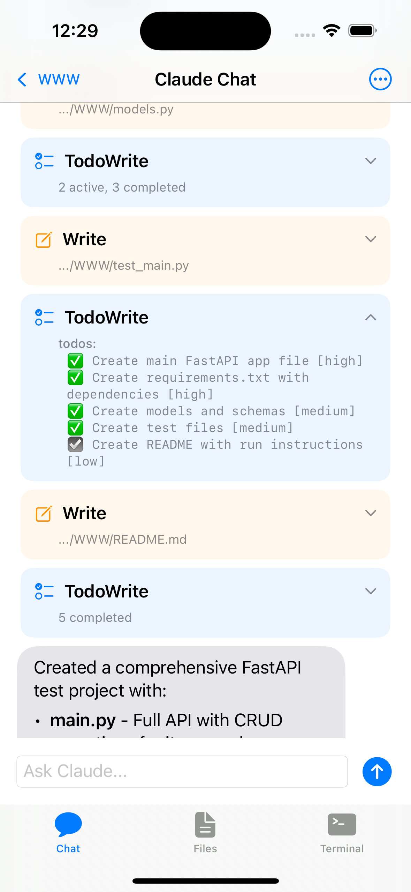
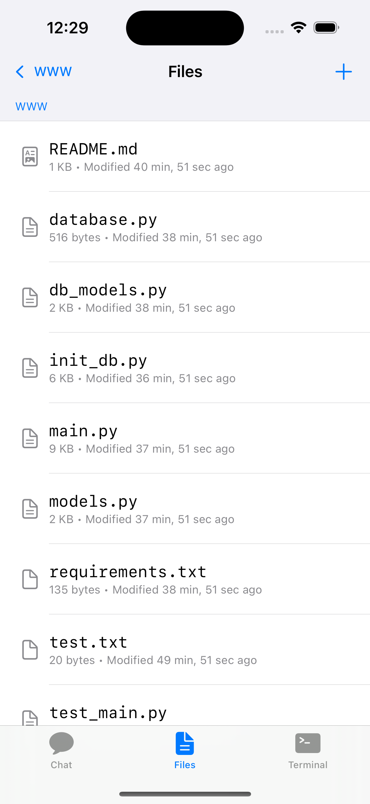
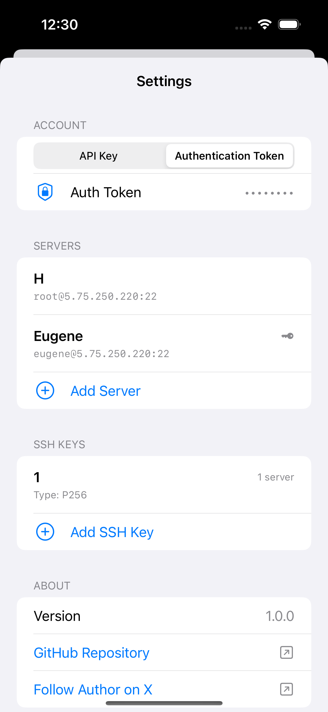
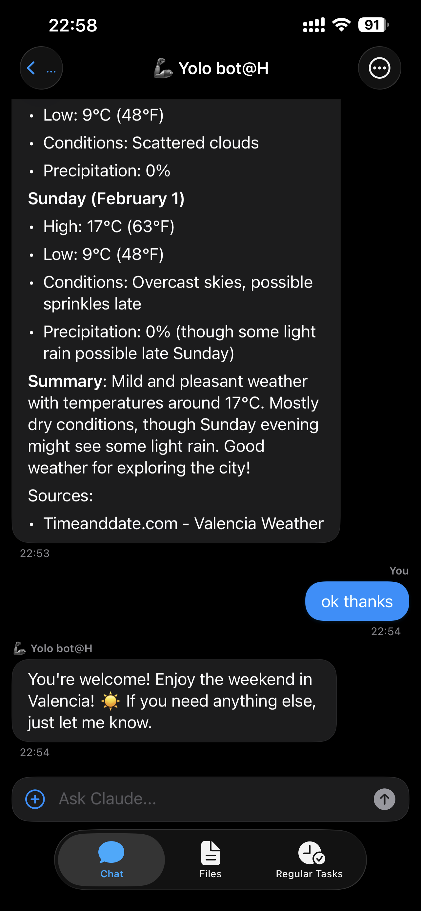
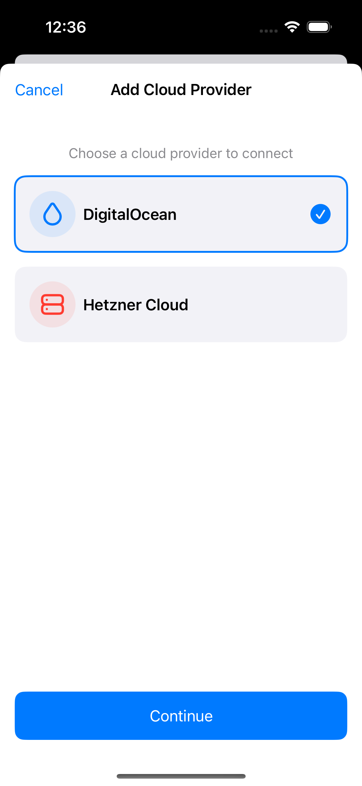
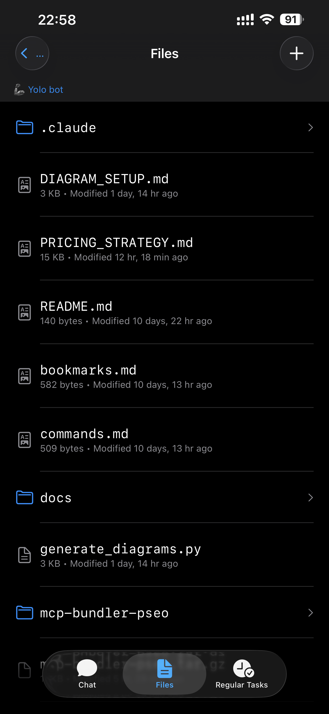
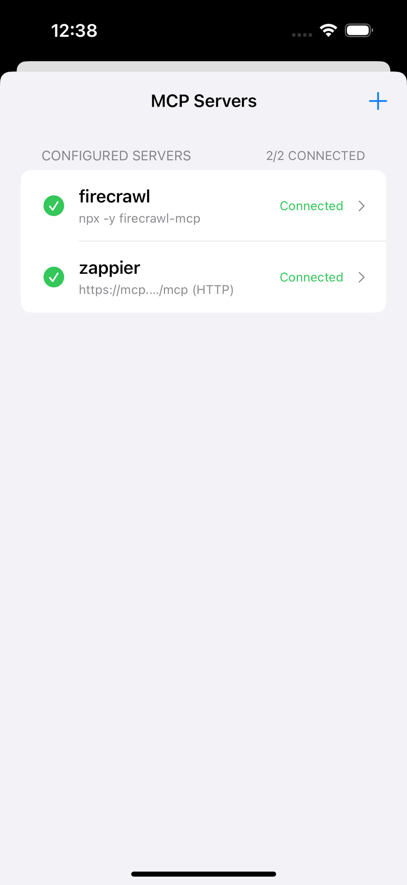
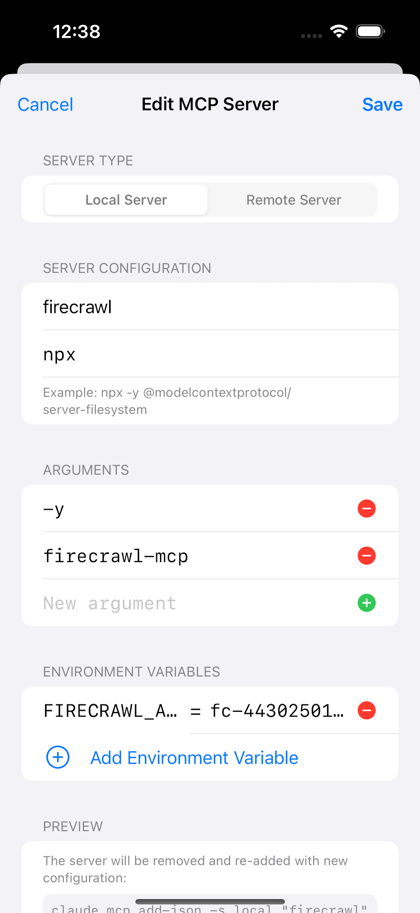

# CodeAgents Mobile

An mobile client to Claude Code for iOS.
Allows you to run Claude code on any Linux ssh server.

**TestFlight Beta**

https://testflight.apple.com/join/eUpweBZV

**AppStore**

https://apps.apple.com/app/codeagents-mobile/id6748273716

## Screenshots

   





## Features
- A rebuilt chat experience: faster, clearer messages, and a smoother overall feel
- Background tasks: start longer actions and keep using the app while they run
- Skills support: add, manage, and use skills to expand what your agent can do
- Better file tools: browse, preview, create/edit, upload, and share files
- Agent controls: rules, permissions, scheduled tasks, and custom environment variables
- More provider choices: Anthropic, Z.ai, Minimax, or Moonshot
- Provision servers with Digital Ocean / Hetzner (auto SSH key setup + Claude Code install)
- MCP servers support
- Connect to remote servers via SSH

## Requirements

- iOS 17.0+
- Xcode 15+
- Swift 5.9+

## Getting Started

```bash
# Clone the repository
git clone [repository-url]

# Open in Xcode
open CodeAgentsMobile.xcodeproj

# Build and run
# Select your target device/simulator and press Cmd+R
```

## Automation

OpenCode automation uses the repository-owned scripts in `scripts/` while the
workflow YAML is generated by the automation controller.

- `scripts/ci.sh` validates the app with XcodeBuildMCP 2.5.0+ structured JSON
  diagnostics by running deterministic `CodeAgentsMobileTests` simulator unit
  tests; live SSH integration suites are skipped unless run explicitly.
- `scripts/ios-simulator-evidence.sh` captures simulator screenshots and demo
  video for native visual validation and demo evidence.
- `scripts/artifact.sh` builds a review simulator `.app.zip` by default and
  emits the controller `published_artifacts` JSON contract; set
  `OPENCODE_ARTIFACT_MODE=testflight` to publish a production build through
  `asc publish testflight`. Production artifact automation runs this mode with
  Phase app `6abec477-1930-4e2e-bd18-554059958ccd` and emits release metadata
  so the controller can attach the IPA and checksum to the matching Gitea
  Release.
- `VERSIONS.TXT` stores the release marketing version. Production builds use
  the Gitea run number as the release build number when available.

The runner must provide Xcode, XcodeBuildMCP 2.5.0 or newer, and the `asc` CLI
for TestFlight publication. XcodeBuildMCP failures print the detected version
plus returned build/runtime/OS log paths when available; scripts do not upgrade
the tool automatically. If `DEVELOPER_DIR` is not set, the scripts default to
`/Applications/Xcode.app/Contents/Developer` when present. TestFlight mode also
expects App Store Connect credentials through `ASC_APP_ID`, `TESTFLIGHT_GROUP`,
`ASC_KEY_ID`, `ASC_ISSUER_ID`, and either `ASC_PRIVATE_KEY_P8` or
`ASC_PRIVATE_KEY_FILE`.

## Developer Diagnostics

Debug builds emit lightweight chat recovery timing lines with the
`[ChatRecoveryTiming]` prefix when chats are reopened or resumed. These logs are
intended to separate local SwiftData load, OpenCode hydration, Claude proxy
history sync, persistence saves, media prefetch, MCP fetch, and resume-streaming
costs before making recovery behavior changes.

OpenCode chat reopen is local-first: persisted SwiftData messages render before
remote recovery. The initial OpenCode recovery fetch is bounded and diffed
against the stored message/part hydration anchors; full-session refresh can run
later in the background when more history may exist.

Claude proxy chat reopen is also local-first for the idle path: if there is no
usable active streaming message, recovery clears transient UI state and returns
without proxy history sync, proxy event fetch, or canonical conversation lookup.
When an active streaming message exists, the app uses the stored
`proxyConversationId`/`proxyLastEventId` first and only refreshes the canonical
conversation after a missing, reset, unknown, or mismatch condition.

The focused recovery tests cover both sides of that decision: idle reopen must
produce a no-remote-work decision, while a usable active stream must keep the
streaming message id so the proxy recovery path can resume it.

Timing metadata is limited to runtime names, project identifiers, operation
labels, elapsed milliseconds, statuses, booleans, and counts. Do not add prompts,
message text, raw payloads, credentials, URLs, project paths, attachment paths,
or file contents to these log fields.

## Architecture

Built with SwiftUI and SwiftData following MVVM pattern.
Icon - https://tabler.io/icons/icon/brain, edited here https://icon.kitchen

## License

This project is licensed under the Apache License, Version 2.0 - see the [LICENSE](LICENSE) file for details.
