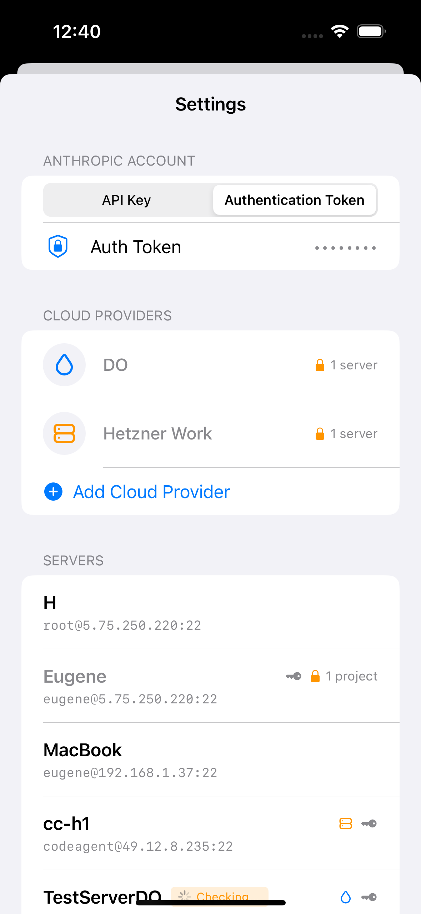
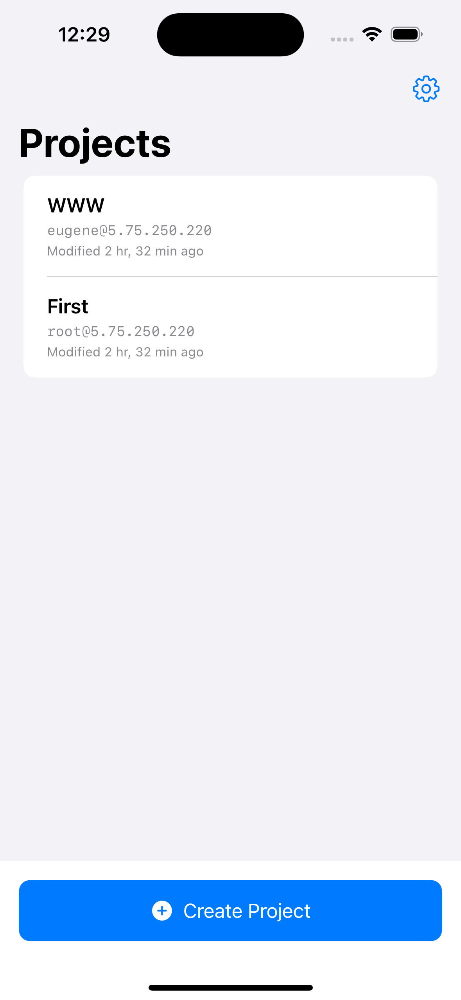
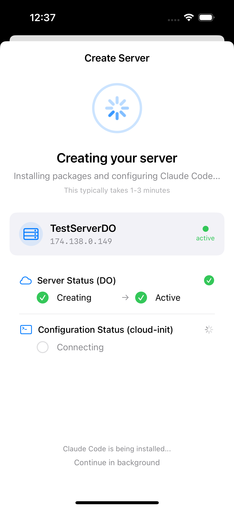
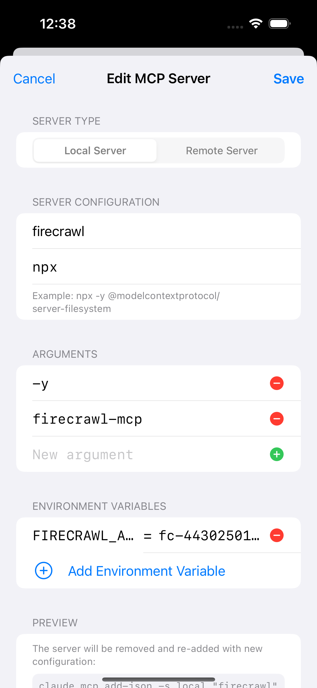

# CodeAgents Mobile

An mobile client to Claude Code for iOS.
Allows you to run Claude code on any Linux ssh server.

**TestFlight Beta**

https://testflight.apple.com/join/eUpweBZV

**AppStore**

https://apps.apple.com/app/codeagents-mobile/id6748273716

## Screenshots

   





## Features
- A rebuilt chat experience: faster, clearer messages, and a smoother overall feel
- Background tasks: start longer actions and keep using the app while they run
- Skills support: add, manage, and use skills to expand what your agent can do
- Better file tools: browse, preview, create/edit, upload, and share files
- Agent controls: rules, permissions, scheduled tasks, and custom environment variables
- More provider choices: Anthropic, Z.ai, Minimax, or Moonshot
- Provision servers with Digital Ocean / Hetzner (auto SSH key setup + Claude Code install)
- MCP servers support
- Connect to remote servers via SSH

## Requirements

- iOS 17.0+
- Xcode 15+
- Swift 5.9+

## Getting Started

```bash
# Clone the repository
git clone [repository-url]

# Open in Xcode
open CodeAgentsMobile.xcodeproj

# Build and run
# Select your target device/simulator and press Cmd+R
```


## Architecture

Built with SwiftUI and SwiftData following MVVM pattern.
Icon - https://tabler.io/icons/icon/brain, edited here https://icon.kitchen

## License

This project is licensed under the Apache License, Version 2.0 - see the [LICENSE](LICENSE) file for details.
